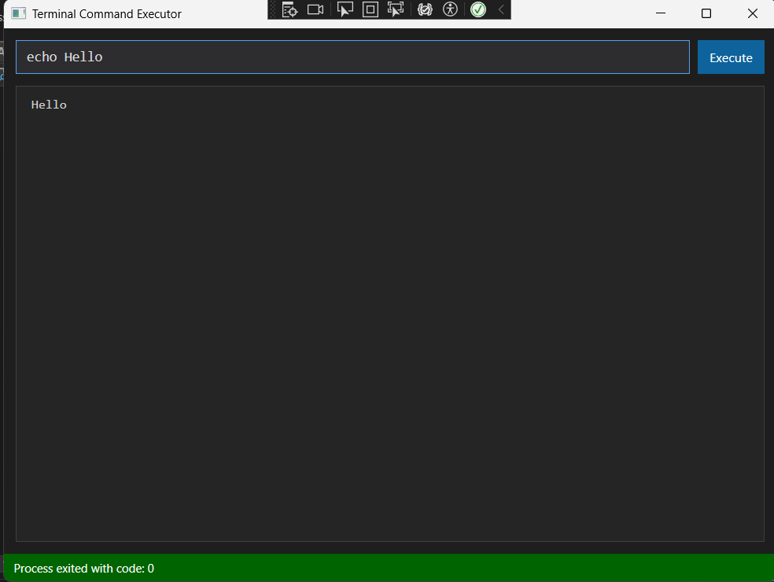

# Terminal Command Executor

A modern, user-friendly GUI application for executing command-line operations with real-time output display and visual feedback.



## Overview

Terminal Command Executor is a Windows desktop application built with C# and WPF that allows users to:

- Execute terminal/shell commands through a clean graphical interface
- View command output in real-time with color coding
- Execute complex commands with arguments, including quoted strings
- See command execution status visually

## Features

### Core Functionality
- Execute any command-line program or built-in shell command
- Support for complex command arguments with proper quote handling
- Real-time output streaming
- Command history (via up/down arrows)

### User Interface
- Modern dark theme to reduce eye strain
- Color-coded output:
  - Standard output (light gray)
  - Error output (red)
- Visual execution status:
  - Blue: Ready/Executing
  - Green: Successful execution (exit code 0)
  - Red: Failed execution (non-zero exit code)
- Clean, responsive design

### Architecture
- Separation of concerns:
  - Command parsing
  - Process execution
  - UI presentation
- Event-based communication (Observer pattern)
- Asynchronous execution to keep UI responsive

## Getting Started

### Prerequisites
- Windows operating system (32-bit or 64-bit)
- .NET 8.0 Runtime or SDK
- Visual Studio 2022 recommended for development

### Installation

#### From Release
1. Download the latest release ZIP file
2. Extract to a location of your choice
3. Run `TerminalExecutor.exe`

#### Build from Source
1. Clone the repository
```
git clone https://github.com/yourusername/terminal-command-executor.git
```

2. Open the solution in Visual Studio
3. Build the solution (F6 or Build → Build Solution)
4. Run the application (F5 or Debug → Start Debugging)

## Usage Examples

### Basic Commands
```
echo Hello World
dir
ipconfig
```

### Commands with Arguments
```
find "Program Files" -name "*.exe"
ping google.com -n 5
systeminfo | findstr /i "memory"
```

### Command Output
The application captures and displays:
- Standard output (stdout)
- Error output (stderr)
- Exit code status

## Project Structure

- **MainWindow.xaml/.cs**: User interface and interaction logic
- **Logic/CommandParser.cs**: Handles command-line parsing
- **Logic/CommandExecutor.cs**: Manages process execution and output capture
- **Tests/**: Unit tests for core functionality

## Architecture Details

### Command Parsing
The application parses command lines similarly to cmd.exe:
- Spaces separate arguments unless within quotes
- Quotes group words together but are removed from the arguments
- Multiple spaces between arguments are collapsed

### Process Execution
Commands are executed asynchronously using `System.Diagnostics.Process`:
- On Windows, commands are executed through cmd.exe
- Standard output and error streams are captured separately
- The UI is updated in real-time as output is available

### Event-Based Communication
The application uses the Observer pattern through C# events:
- `CommandExecutor` raises events when output is available
- `MainWindow` subscribes to these events and updates the UI
- This creates loose coupling between components

## Development

### Building and Testing
```
dotnet build
dotnet test
```

### Adding New Features
The modular design makes it easy to add new features:
1. Modify command parsing in `CommandParser.cs`
2. Enhance process execution in `CommandExecutor.cs`
3. Update the UI in `MainWindow.xaml/.cs`

## Contributing

Contributions are welcome! Please feel free to submit a Pull Request.

## Testing

The application includes unit tests for core functionality:
- Command parsing tests
- Command execution tests

Run tests through Visual Studio's Test Explorer or via command line:
```
dotnet test
```

## License

This project is licensed under the MIT License - see the LICENSE file for details.

## Acknowledgments

- Inspired by the need for a simpler, more visual command execution tool
- Built with WPF for a modern UI experience
